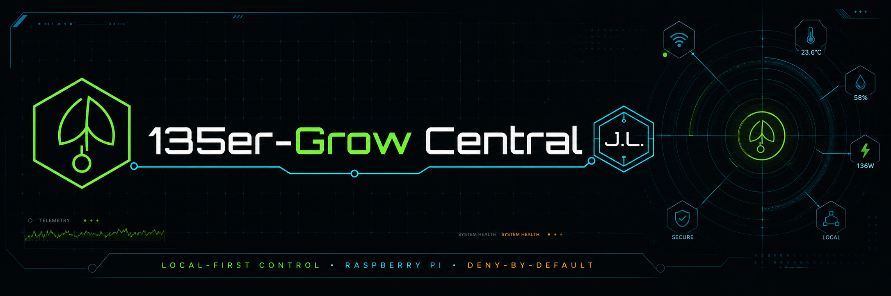
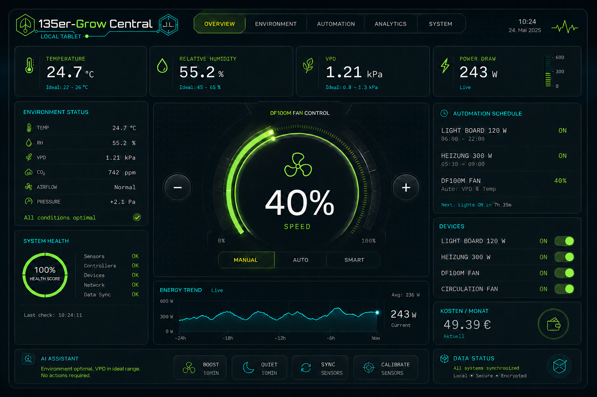
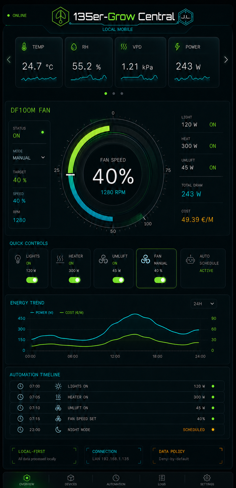
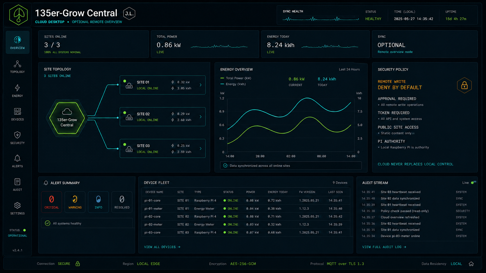

<p align="center"></p>

<p align="center">
  <a href="#deutsch"><strong>Deutsch</strong></a> · <a href="#english"><strong>English</strong></a> · <a href="docs/README.md">Docs</a> · <a href="docs/de/INSTALLATION.md">Installation</a> · <a href="SECURITY.md">Security</a>
</p>

<p align="center">
  
  
  
  
</p>

<p align="center"><code>LOCAL-FIRST</code> · <code>RASPBERRY PI</code> · <code>MARS HYDRO iCONNECT</code> · <code>POWER TELEMETRY</code> · <code>SMART HOME</code></p>

> [!WARNING]
> **Alpha / hardware validation.** Das System befindet sich weiterhin in einer frühen Alpha-Phase. Ein heute erfolgreich gestartetes Testimage bestätigt die ersten Grundfunktionen, ersetzt aber noch keine vollständige Hardware-, Kommunikations- oder Ausfallsicherheitsprüfung.

## Deutsch

**135er-Grow Central** ist eine lokale Steuer- und Überwachungsplattform für Klima, Beleuchtung, Abluft, Energie, Sensorik und Automationen. Der Raspberry Pi bleibt die autoritative Master-Instanz. Cloud-Funktionen sind optional und dürfen die lokale Funktion niemals ersetzen.

### Verbindliche Mars-Hydro-Hardwarebasis

| Gerät | Projektdefinition | Integrationsrichtung |
|---|---|---|
| **Mars Hydro FC3000** | Modelljahr **2024**, USB-Port, **iConnect**-fähig | gemeinsame Mars-Hydro/iConnect-Gerätefamilie |
| **Mars Hydro DF100 / iFresh-Serie** | iFresh-Lüfterfamilie mit **iConnect** | gemeinsame Mars-Hydro/iConnect-Gerätefamilie |
| **DF100M / MZ_MZF002** | bisher beobachtete BLE-Identität / Firmware V1.8 | experimenteller Diagnose- und Fallbackpfad, solange kein validierter lokaler iConnect-Pfad dokumentiert ist |

Die frühere Annahme, DF100/DF100M ausschließlich als eigenständiges BLE-Gerät zu behandeln, ist damit überholt. Die Zielarchitektur bündelt FC3000 und iFresh unter einer gemeinsamen **Mars-Hydro/iConnect-Abstraktionsschicht**. Direkte BLE-Kommunikation bleibt bewusst experimentell und standardmäßig schreibgeschützt.

### Systemarchitektur

```text
Mars Hydro FC3000 2024 ─┐
Mars Hydro iFresh/DF100 ├──► Mars-Hydro/iConnect-Schicht ─┐
DF100M BLE Diagnose ────┘                                  │
Smart Plugs · Sensoren · Kamera · Home Assistant ─────────┤
                                                          ▼
                                               135er-Grow Central Local
                                                  Raspberry Pi 3B Master
                                                   │      │      │
                                                SQLite  FastAPI  Audit
                                                   │
                                                   └─ outbound HTTPS ─► optionale Cloud
```

**Kein ESP32 ist Bestandteil der Zielarchitektur.** Der Raspberry Pi übernimmt lokale Steuerung, Onboarding, Diagnose, Web-GUI und die kontrollierte Cloud-Anbindung.

### Aktueller Image-Stand

Der aktuelle Raspberry-Pi-3B-Teststand zeigt in den ersten Grundfunktionen ein gutes Verhalten. Für die Alpha-Validierung bleiben insbesondere reale WLAN/DHCP-, Bluetooth-, Kamera-, Mars-Hydro/iConnect- und Gerätekommunikationstests offen. Das Image enthält bzw. berücksichtigt den First-Boot-AP, die Web-Ersteinrichtung, GUI-Recovery/Watchdog, Bluetooth-Namensanzeige sowie Logitech-C920-Laufzeitunterstützung.

### Weitere Integrationen

- **TP-Link Tapo**: lokale/Cloud-Erkennung und Home-Assistant-Pfad; Login/Import bleibt gesondert zu validieren.
- **FRITZ!SmartHome**: Home-Assistant-Bridge bzw. lokale AVM-Integration als Projektpfad.
- **Shelly Gen2+**: lokaler JSON-RPC-Baselinepfad.
- **Smart Plugs**: Schaltzustand, W, kWh, V, A, Hz sowie Zeit-/Kostenstatistiken; reale Hardwarevalidierung je Adapter bleibt erforderlich.
- **Logitech C920**: Kamera-Unterstützung mit `ffmpeg`, `v4l-utils` und Video-Gruppenzugriff im Image vorgesehen.
- **Bluetooth**: Geräte sollen mit verständlichen Namen und Typ-Hinweisen statt nur MAC-Adressen dargestellt werden.

### Sicherheitsmodell

Jeder Schreibzugriff muss die bekannten Gates passieren: Gerät **bekannt**, **freigegeben**, explizit **beschreibbar** und Anfrage **authentifiziert**. Mars-Hydro-/DF100M-Schreibzugriffe, Cloud-Kommandos und Remote-Steuerung bleiben standardmäßig deaktiviert, solange der jeweilige Pfad nicht reproduzierbar validiert ist.

### Schnellstart

```bash
git clone https://github.com/jygnw29kms-bit/135er-Grow-Central.git
cd 135er-Grow-Central
python3 -m venv .venv
source .venv/bin/activate
pip install -r requirements.txt
uvicorn app.main:app --host 0.0.0.0 --port 8080
```

Weiterlesen: [Deutsche Dokumentation](docs/de/README.md) · [Integrationen](docs/de/INTEGRATIONEN.md) · [Mars Hydro / iConnect](docs/MARS_HYDRO_ICONNECT.md) · [Raspberry-Pi-Testimage](docs/de/RASPBERRY_PI_3B_TEST_IMAGE.md)

---

## English

**135er-Grow Central** is a local-first platform for climate, lighting, ventilation, energy, sensors, and automation. The Raspberry Pi 3B remains the authoritative local master. Cloud services are optional and must never become a single point of failure.

### Authoritative Mars Hydro hardware baseline

| Device | Project definition | Integration direction |
|---|---|---|
| **Mars Hydro FC3000** | **2024** generation, USB port, **iConnect** capable | shared Mars Hydro/iConnect device family |
| **Mars Hydro DF100 / iFresh series** | iFresh fan family using **iConnect** | shared Mars Hydro/iConnect device family |
| **DF100M / MZ_MZF002** | previously observed BLE identity / firmware V1.8 | experimental diagnostics and fallback path until a validated local iConnect path exists |

The earlier model of treating DF100/DF100M only as a standalone BLE device is obsolete. FC3000 and iFresh are now modeled under one Mars Hydro/iConnect abstraction. Direct BLE remains experimental and write-disabled by default.

**ESP32 is explicitly not part of the target architecture.** Raspberry Pi owns local control, onboarding, diagnostics, the web UI, and optional cloud communication.

### Current image state

The current Raspberry Pi 3B image is reported to behave well in its first basic functions. This is an encouraging alpha result, not yet a complete validation of WLAN/DHCP, Bluetooth, camera, Mars Hydro/iConnect communication, actuator writes, or failure recovery on real target hardware.

Continue with: [English documentation](docs/en/README.md) · [Integrations](docs/en/INTEGRATIONS.md) · [Mars Hydro / iConnect](docs/MARS_HYDRO_ICONNECT.md) · [First-boot guide](docs/en/RASPBERRY_PI_3B_TEST_IMAGE.md)

## Interface family / Interface-Familie

<table>
  <tr>
    <td width="50%"><br><strong>Local Desktop</strong></td>
    <td width="50%"><br><strong>Local Tablet</strong></td>
  </tr>
  <tr>
    <td width="50%"><br><strong>Local Mobile</strong></td>
    <td width="50%"><br><strong>Cloud Desktop</strong></td>
  </tr>
</table>

> [!NOTE]
> Die dargestellten GUI-Werte sind Konzept-Telemetrie und keine bestätigten Live-Messwerte. / GUI values shown are concept telemetry, not confirmed live measurements.

## Brand system / Markensystem

Repository, Website, lokale GUI, Cloud-GUI und Raspberry-Pi-Image verwenden dieselbe dunkle Control-Room-/HUD-Ästhetik. Das 135er-Grow-Central-Logo bleibt verbindlich; das `J.L.`-Markenzeichen wird dezent integriert. Runtime-Grafiken werden als PNG bereitgestellt; WebP wird nicht verwendet.

<p align="center"></p>
