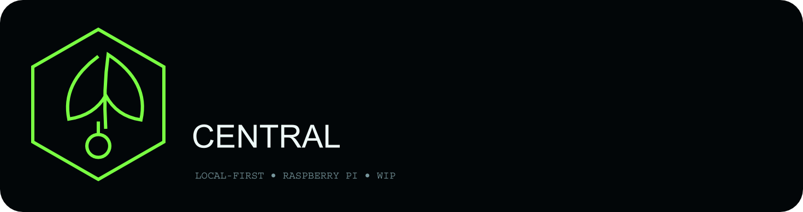

# 135er-Grow Central

<p align="center"></p>
<p align="center"><strong>LOCAL-FIRST · RASPBERRY PI · SMART HOME · POWER TELEMETRY</strong></p>
<p align="center"><code>🚧 WORK IN PROGRESS</code> &nbsp; <code>alpha-0.7.1</code> &nbsp; <code>deny-by-default writes</code></p>

> [!WARNING]
> **Work in Progress:** Hardware- und Protokollpfade werden weiter validiert. Der Raspberry Pi bleibt die lokale Autorität; optionale Cloud-Funktionen ersetzen die lokale Steuerung nicht.

## Vier GUI-Clients · ein Design


## Architektur

```text
Geräte / Sensoren / Smart Plugs
            |
            v
   135er-Grow Central Local
        Raspberry Pi
       /     |      \
  BLE DF100M |       Shelly RPC
             |
           SQLite
             | outbound HTTPS
             v
       optional cloud
```

## Branding
- Logo: `website/assets/brand/135er-grow-central-logo.png`
- Markenzeichen: `website/assets/brand/135er-grow-central-mark.png`
- Logo dominant; Markenzeichen klein und dauerhaft sichtbar.
- Kein WebP.

## Raspberry Pi
Bootlogo und ASCII-Konsolenbegrüßung werden im Image-Build eingebunden.
