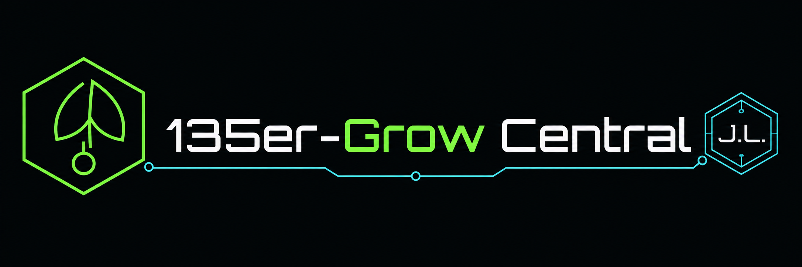

# 135er-Grow Central · Documentation Hub

> [!IMPORTANT]
> Grow Central verwendet verbindlich **ein Universal-Image mit Hardwareprofilen**. Pi 3B/3B+ = `LEGACY_LITE`; Pi 4/400/CM4 = `FULL_SUPPORT` Standard; Pi 5/CM5 = `FULL_SUPPORT` Performance. Build 199 ist der aktuelle `alpha-0.7.5` Candidate. Die automatisierten Gates sind bestanden; reale Hardwarevalidierung steht noch aus. Neue veröffentlichbare Artefakte werden offen über die öffentlichen Projektkanäle bereitgestellt und dokumentiert.

## Zuerst lesen

1. [Kanonischer Release State](../RELEASE_STATE.md)
2. [Hardware Support Policy](HARDWARE_SUPPORT_POLICY.md)
3. [Hardware-Testplan](HARDWARE_TEST_PLAN.md)
4. [Aktueller Projektstatus](PROJECT_STATUS.md)
5. [Release Pipeline](RELEASE_PIPELINE.md)
6. [GrowCentral Nexus UI](DESIGN_SYSTEM_NEXUS.md)
7. [Projektgeschichte](../PROJECT_HISTORY.md)
8. [Architektur-Master](ARCHITECTURE_MASTER.md)
9. [Security & Trust Model](SECURITY_AND_TRUST_MODEL.md)
10. [Known Limitations](KNOWN_LIMITATIONS.md)

## Verbindliche Hardwarebegriffe

- **Legacy/Lite:** Pi 3B / 3B+ – unterstützt, konservative Ressourcenprofile.
- **Full Support Standard:** Pi 4 / 400 / CM4 – empfohlene Referenzplattform.
- **Full Support Performance:** Pi 5 / CM5 – Performanceplattform.
- **Universal Image:** ein reguläres Image für alle unterstützten Klassen.
- **Separate Images:** nur bei technisch zwingend unterschiedlichen Kernel-/Paket-/Servicebasen.

Neue Features dürfen nicht durch die Leistungsgrenzen des Pi 3 begrenzt werden. Runtime-Komponenten sollen die zentrale Quelle `shared/hardware_profile.py` verwenden.

## Aktueller Testfokus

- reale Hardwarevalidierung von Build 199;
- automatische Hardwareklassifikation und Diagnoseausgabe;
- Pi-3-Legacy/Lite-Ressourcenprofil;
- Pi-4/5-Full-Support-Pfad;
- First Boot / LAN / WLAN / AP / Persistenz;
- Logitech C920/UVC mit hardwareabhängigen Auflösungsgrenzen;
- stabiler headless Betrieb;
- FRITZ!/Tapo;
- Cloud V7 und Entitlements;
- Support-/Diagnosepfade.

## Plattform-Dokumentation

- [API](API.md)
- [Architecture](ARCHITECTURE.md)
- [Architecture Master](ARCHITECTURE_MASTER.md)
- [Cloud](CLOUD.md)
- [Installation](INSTALLATION.md)
- [Protocol Notes](PROTOCOL_NOTES.md)
- [Troubleshooting](TROUBLESHOOTING.md)
- [Sources](SOURCES.md)
- [Decision Log](DECISION_LOG.md)

## Sprachversionen

- [Deutsch](de/README.md)
- [English](en/README.md)

## Dokumentationsregeln

- `implemented`: Code/Laufzeit vorhanden.
- `experimental`: vorhanden, aber nicht ausreichend am Zielgerät validiert.
- `candidate`: für den nächsten Zieltest vorgesehen.
- `validated`: relevanter realer Zieltest erfolgreich.
- `baseline/design`: Architektur/Interface definiert.
- `planned`: noch nicht implementiert.
- Build- und Hardwarestatus werden aus den kanonischen Dokumenten übernommen und nicht lokal erfunden.
- Historische Builddateien bleiben nachvollziehbar, definieren aber nicht den aktuellen Stand.

---

## English

GrowCentral uses **one universal Raspberry Pi image with runtime hardware profiles**. Pi 3B/3B+ is Legacy/Lite; Pi 4/400/CM4 and Pi 5/CM5 are Full Support. See [Hardware Support Policy](HARDWARE_SUPPORT_POLICY.md) and [Release State](../RELEASE_STATE.md).
