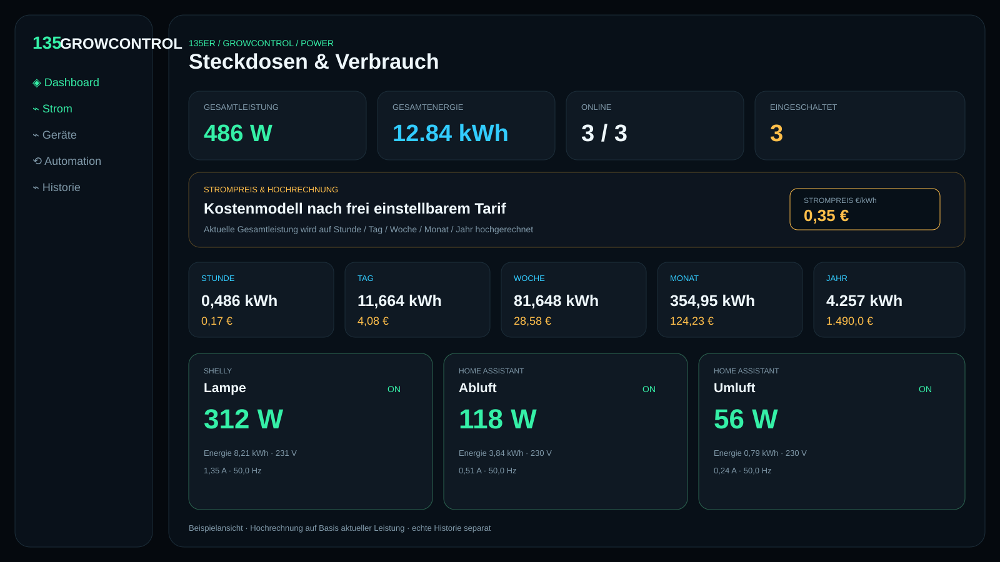

# GUI Target and Responsive Design

This document defines the current preview image as the **authoritative design reference** for the finished 135er GrowControl user interface.

## Current v0.7 design

## Original v0.5 design

The v0.7 reference adds smart-plug states, power telemetry, a configurable
electricity tariff and hour/day/week/month/year projections. Both images remain
available as traceable design milestones.

## Target design

The final interface should follow this reference visually and functionally. The dashboard remains dark, futuristic, clear and suitable for continuous use on desktop, tablet/iPad and smartphone devices.

Key elements of the reference:

- left-hand navigation for Dashboard, Devices, Sensors, History, Schedules, Automations, Cloud and System
- central live cards for temperature, humidity, VPD, fan state, cloud sync and system status
- DF100M device control with device state, BLE state, speed and diagnostic functions
- local/cloud architecture status at a glance
- historical charts for sensor and system data
- schedules and automations directly visible in the dashboard
- security and platform status without overloading the primary controls
- clear status semantics for OK, warning, offline and experimental functions

## Responsive requirements

The interface must not simply shrink. It must structurally adapt to the available viewport.

### Large desktop — 1400 px and above

- fixed sidebar
- 3- to 4-column dashboard grid
- large history charts
- device, cloud and automation panels displayed side by side
- full status and diagnostic information visible

### Desktop / notebook — 1024 to 1399 px

- sidebar remains visible or switches to a compact mode
- 2- to 3-column grid
- secondary information may move into details or drawers
- charts scale without horizontal page scrolling

### Tablet / iPad — 768 to 1023 px

- touch-optimized controls
- 2-column grid with selected full-width cards
- collapsible sidebar or compact icon navigation
- core values, alarms and device actions remain directly accessible
- interactive targets should be approximately 44 x 44 CSS pixels or larger
- no hover-only functionality

### Smartphone — below 768 px

- single-column card layout
- drawer/hamburger navigation or bottom primary navigation
- prioritize live status, alarms, devices, quick actions and schedules
- complex tables are represented as cards/lists
- charts fit the viewport and may support horizontal zoom where useful
- secondary diagnostic information moves to detail views

## Technical frontend rules

- use CSS Grid/Flexbox rather than fixed pixel layouts
- use `clamp()`, relative units and responsive typography
- no fixed total dashboard width
- cards must wrap automatically on narrow viewports
- chart components must observe their container width
- navigation must be usable with keyboard and touch
- contrast and typography must remain readable during continuous tablet operation
- account for iPhone/iPad safe-area insets
- browser zoom must not break the layout

## Content priority

As the viewport gets smaller, preserve content in this order:

1. alarms and system status
2. temperature, humidity, VPD and primary sensor values
3. active devices and current setpoints
4. quick controls and schedules
5. history/charts
6. cloud and diagnostic information

## Design boundary

The preview image is a **visual target reference**, not a pixel-perfect mockup for every resolution. The real implementation may move, collapse or group elements into detail views as long as the interaction model, information hierarchy and characteristic 135er GrowControl look remain intact.
