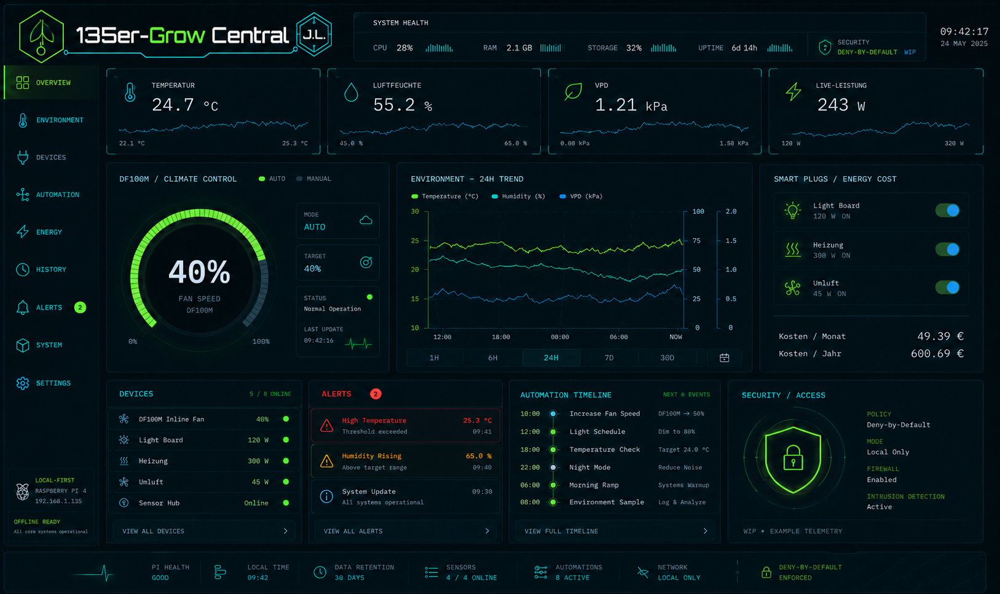

# GUI und Responsive Design

Das Bild ist die verbindliche visuelle Zielreferenz für die fertige GUI.

## Branding

Rastergrafiken werden im Projekt als **PNG** eingebunden. WebP wird nicht mehr verwendet, da die Darstellung auf dem produktiven Hosting nicht zuverlässig war. Favicons dürfen als ICO und technische Diagramme als SVG vorliegen.

Website, lokale GUI und Cloud-GUI verwenden das 135er-Grow Central-Logo in PNG-Form.

## Desktop ab 1400 px

Feste Sidebar, 3–4 Spalten, große Charts, vollständige Diagnose- und Cloud-Karten.

## Notebook 1024–1399 px

2–3 Spalten, kompaktere Sidebar, sekundäre Daten in Detailansichten.

## Tablet/iPad 768–1023 px

Touch-optimierte Controls, 2 Spalten, einklappbare Navigation, keine Hover-only-Funktionen, mindestens ungefähr 44 × 44 CSS-Pixel für wichtige Touch-Ziele.

## Smartphone unter 768 px

Einspaltiges Layout, Drawer oder Bottom Navigation, priorisierte Live-Werte/Alarme/Schnellaktionen, Tabellen als Karten.

## Informationspriorität

1. Alarm/Systemstatus
2. Temperatur/Luftfeuchte/VPD
3. aktive Geräte und Sollwerte
4. Schnellaktionen/Zeitpläne
5. Historie
6. Cloud/Diagnose
