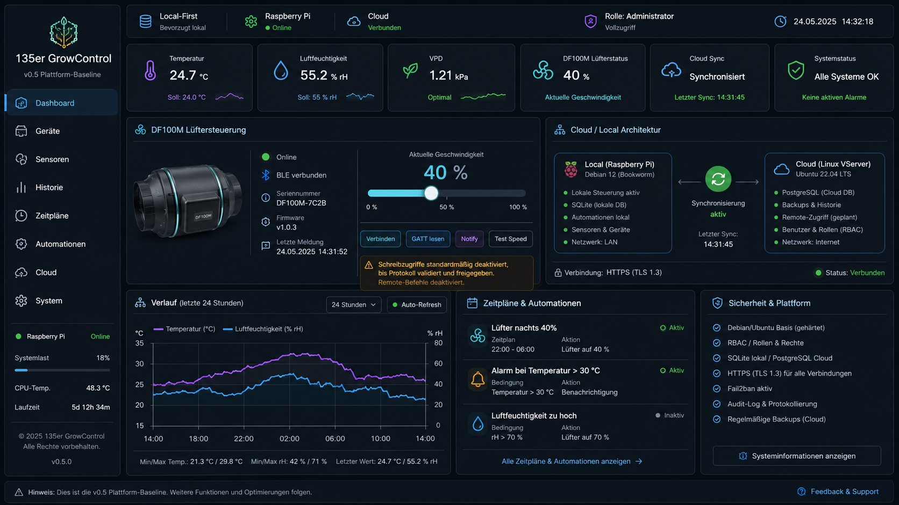

# GUI and Responsive Design

The image is the authoritative visual target for the finished GUI.

## Branding

The signed **J. L. 1976** master logo remains mandatory for project surfaces. Two additional presentation assets are available for GitHub and web metadata:

- `website/assets/brand/135er-growcontrol-repo-banner.webp` – repository/social banner
- `website/assets/brand/135er-growcontrol-repo-mark.png` – square repository mark / app icon
- `website/assets/brand/favicon.ico` – browser favicon

The banner and square mark complement the signed master trademark; they do not replace it.

- >=1400 px: fixed sidebar, 3–4 columns, full diagnostics
- 1024–1399 px: 2–3 columns, compact navigation
- 768–1023 px: touch-first tablet/iPad layout, 2 columns, collapsible navigation
- <768 px: single-column mobile layout, drawer/bottom navigation, prioritized status and quick actions

No hover-only controls. Important touch targets should be about 44×44 CSS px or larger.
